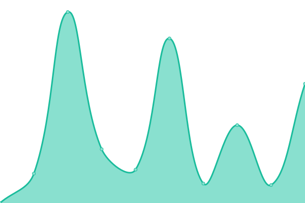

# [📈 Live Status](https://demo.upptime.js.org): <!--live status--> **🟧 Partial outage**

This repository contains the open-source uptime monitor and status page for [Upptime](https://upptime.js.org), powered by [Upptime](https://github.com/upptime/upptime).

With [Upptime](https://upptime.js.org), you can get your own unlimited and free uptime monitor and status page, powered entirely by a GitHub repository. We use [Issues](https://github.com/upptime/upptime/issues) as incident reports, [Actions](https://github.com/elfoche/monitoreo/actions) as uptime monitors, and [Pages](https://demo.upptime.js.org) for the status page.

<!--start: status pages-->
<!-- This summary is generated by Upptime (https://github.com/upptime/upptime) -->
<!-- Do not edit this manually, your changes will be overwritten -->
<!-- prettier-ignore -->
| URL | Status | History | Response Time | Uptime |
| --- | ------ | ------- | ------------- | ------ |
|  [UNER - Web](https://uner.edu.ar) | 🟩 Up | [uner-web.yml](https://github.com/elfoche/monitoreo/commits/HEAD/history/uner-web.yml) | 

 1329ms
     
 | 

<a href="https://elfoche.github.io/monitoreo/history/uner-web">100.00%</a>
    

|  [UNER - Campus](https://campus.uner.edu.ar) | 🟩 Up | [uner-campus.yml](https://github.com/elfoche/monitoreo/commits/HEAD/history/uner-campus.yml) | 

 1201ms
     
 | 

<a href="https://elfoche.github.io/monitoreo/history/uner-campus">100.00%</a>
    

|  [UNER - Diaguita](https://diaguita.uner.edu.ar) | 🟩 Up | [uner-diaguita.yml](https://github.com/elfoche/monitoreo/commits/HEAD/history/uner-diaguita.yml) | 

 1340ms
     
 | 

<a href="https://elfoche.github.io/monitoreo/history/uner-diaguita">100.00%</a>
    

|  [UNER - Guaraní](https://g3autogestion.uner.edu.ar/g3w3/) | 🟩 Up | [uner-guarani.yml](https://github.com/elfoche/monitoreo/commits/HEAD/history/uner-guarani.yml) | 

 882ms
     
 | 

<a href="https://elfoche.github.io/monitoreo/history/uner-guarani">100.00%</a>
    

|  [UNER - Comdoc](http://jboss.comdoc.uner.edu.ar/comdocII/webtier/Signin) | 🟥 Down | [uner-comdoc.yml](https://github.com/elfoche/monitoreo/commits/HEAD/history/uner-comdoc.yml) | 

 0ms
     
 | 

<a href="https://elfoche.github.io/monitoreo/history/uner-comdoc">100.00%</a>
    

|  [UNER - GitLab](https://gitlab.uner.edu.ar/users/sign_in) | 🟩 Up | [uner-git-lab.yml](https://github.com/elfoche/monitoreo/commits/HEAD/history/uner-git-lab.yml) | 

 1015ms
     
 | 

<a href="https://elfoche.github.io/monitoreo/history/uner-git-lab">99.16%</a>
    

|  [UNER - DDJJ](https://autogestion.uner.edu.ar/) | 🟩 Up | [uner-ddjj.yml](https://github.com/elfoche/monitoreo/commits/HEAD/history/uner-ddjj.yml) | 

 924ms
     
 | 

<a href="https://elfoche.github.io/monitoreo/history/uner-ddjj">100.00%</a>
    

|  [UNER - Turnero](https://turnosfirmadigital.uner.edu.ar/nuevo-turno) | 🟩 Up | [uner-turnero.yml](https://github.com/elfoche/monitoreo/commits/HEAD/history/uner-turnero.yml) | 

 888ms
     
 | 

<a href="https://elfoche.github.io/monitoreo/history/uner-turnero">100.00%</a>
    

|  [UNER - Redmine](https://redmine.uner.edu.ar/) | 🟩 Up | [uner-redmine.yml](https://github.com/elfoche/monitoreo/commits/HEAD/history/uner-redmine.yml) | 

 1165ms
     
 | 

<a href="https://elfoche.github.io/monitoreo/history/uner-redmine">100.00%</a>
    

|  [UNER - Jitsi](https://jitsi.uner.edu.ar/) | 🟩 Up | [uner-jitsi.yml](https://github.com/elfoche/monitoreo/commits/HEAD/history/uner-jitsi.yml) | 

 1028ms
     
 | 

<a href="https://elfoche.github.io/monitoreo/history/uner-jitsi">100.00%</a>
    

|  [UADER - Web](https://fcytcdelu.uader.edu.ar/) | 🟩 Up | [uader-web.yml](https://github.com/elfoche/monitoreo/commits/HEAD/history/uader-web.yml) | 

 2464ms
     
 | 

<a href="https://elfoche.github.io/monitoreo/history/uader-web">99.81%</a>
    

|  [UADER - Campus](https://campus.fcytcdelu.uader.edu.ar/) | 🟩 Up | [uader-campus.yml](https://github.com/elfoche/monitoreo/commits/HEAD/history/uader-campus.yml) | 

 1254ms
     
 | 

<a href="https://elfoche.github.io/monitoreo/history/uader-campus">100.00%</a>
    

|  [UADER - Guaraní](http://guarani3w.uader.edu.ar/gestion/) | 🟩 Up | [uader-guarani.yml](https://github.com/elfoche/monitoreo/commits/HEAD/history/uader-guarani.yml) | 

 807ms
     
 | 

<a href="https://elfoche.github.io/monitoreo/history/uader-guarani">100.00%</a>
    

|  [UCU - Web](https://ucu.edu.ar) | 🟩 Up | [ucu-web.yml](https://github.com/elfoche/monitoreo/commits/HEAD/history/ucu-web.yml) | 

 2655ms
     
 | 

<a href="https://elfoche.github.io/monitoreo/history/ucu-web">99.94%</a>
    

|  [UCU - Campus](https://moodle.ucu.edu.ar/) | 🟩 Up | [ucu-campus.yml](https://github.com/elfoche/monitoreo/commits/HEAD/history/ucu-campus.yml) | 

 1671ms
     
 | 

<a href="https://elfoche.github.io/monitoreo/history/ucu-campus">100.00%</a>
    

|  [UCU - SAO](https://alumnos.ucu.edu.ar/) | 🟥 Down | [ucu-sao.yml](https://github.com/elfoche/monitoreo/commits/HEAD/history/ucu-sao.yml) | 

 1150ms
     
 | 

<a href="https://elfoche.github.io/monitoreo/history/ucu-sao">100.00%</a>
    

|  [UCU - SIG](http://administracion.ucu.edu.ar/) | 🟩 Up | [ucu-sig.yml](https://github.com/elfoche/monitoreo/commits/HEAD/history/ucu-sig.yml) | 

 949ms
     
 | 

<a href="https://elfoche.github.io/monitoreo/history/ucu-sig">100.00%</a>
    

|  [UCU - Koha](http://biblioteca.ucu.edu.ar/) | 🟩 Up | [ucu-koha.yml](https://github.com/elfoche/monitoreo/commits/HEAD/history/ucu-koha.yml) | 

 4591ms
     
 | 

<a href="https://elfoche.github.io/monitoreo/history/ucu-koha">99.83%</a>
    

|  [UCU - Maraton](https://maraton.ucu.edu.ar/) | 🟩 Up | [ucu-maraton.yml](https://github.com/elfoche/monitoreo/commits/HEAD/history/ucu-maraton.yml) | 

 1324ms
     
 | 

<a href="https://elfoche.github.io/monitoreo/history/ucu-maraton">100.00%</a>
    

|  [MCU - Web](https://cdeluruguay.gob.ar/) | 🟩 Up | [mcu-web.yml](https://github.com/elfoche/monitoreo/commits/HEAD/history/mcu-web.yml) | 

 4950ms
     
 | 

<a href="https://elfoche.github.io/monitoreo/history/mcu-web">100.00%</a>
    

|  [MCU - GTH](http://produccion.cdeluruguay.gob.ar/GTH/forms/login.jsp) | 🟩 Up | [mcu-gth.yml](https://github.com/elfoche/monitoreo/commits/HEAD/history/mcu-gth.yml) | 

 3163ms
     
 | 

<a href="https://elfoche.github.io/monitoreo/history/mcu-gth">99.72%</a>
    

|  [MCU - GAF](http://produccion.cdeluruguay.gob.ar/GAF/forms/login.jsp) | 🟩 Up | [mcu-gaf.yml](https://github.com/elfoche/monitoreo/commits/HEAD/history/mcu-gaf.yml) | 

 198ms
     
 | 

<a href="https://elfoche.github.io/monitoreo/history/mcu-gaf">100.00%</a>
    

|  [MCU - GRH](http://produccion.cdeluruguay.gob.ar/GRH/forms/login.jsp) | 🟩 Up | [mcu-grh.yml](https://github.com/elfoche/monitoreo/commits/HEAD/history/mcu-grh.yml) | 

 259ms
     
 | 

<a href="https://elfoche.github.io/monitoreo/history/mcu-grh">100.00%</a>
    

|  [MCU - GAT](http://produccion.cdeluruguay.gob.ar/GAT/forms/login.jsp) | 🟩 Up | [mcu-gat.yml](https://github.com/elfoche/monitoreo/commits/HEAD/history/mcu-gat.yml) | 

 199ms
     
 | 

<a href="https://elfoche.github.io/monitoreo/history/mcu-gat">100.00%</a>
    

|  [MCU - GTH](http://produccion.cdeluruguay.gob.ar/GTH/forms/login.jsp) | 🟩 Up | [mcu-gth.yml](https://github.com/elfoche/monitoreo/commits/HEAD/history/mcu-gth.yml) | 

 3163ms
     
 | 

<a href="https://elfoche.github.io/monitoreo/history/mcu-gth">99.72%</a>
    

|  [MCU - STS](http://produccion.cdeluruguay.gob.ar/STS/forms/login.jsp) | 🟩 Up | [mcu-sts.yml](https://github.com/elfoche/monitoreo/commits/HEAD/history/mcu-sts.yml) | 

 340ms
     
 | 

<a href="https://elfoche.github.io/monitoreo/history/mcu-sts">100.00%</a>
    

|  [MCU - Owncloud](https://cloud.cdeluruguay.gob.ar/login?redirect_url=/apps/dashboard/) | 🟩 Up | [mcu-owncloud.yml](https://github.com/elfoche/monitoreo/commits/HEAD/history/mcu-owncloud.yml) | 

 4700ms
     
 | 

<a href="https://elfoche.github.io/monitoreo/history/mcu-owncloud">100.00%</a>
    

|  [MCU - Proyectos](http://proyectos.cdeluruguay.gob.ar/login?back_url=http%3A%2F%2Fproyectos.cdeluruguay.gob.ar%2F) | 🟩 Up | [mcu-proyectos.yml](https://github.com/elfoche/monitoreo/commits/HEAD/history/mcu-proyectos.yml) | 

 4041ms
     
 | 

<a href="https://elfoche.github.io/monitoreo/history/mcu-proyectos">100.00%</a>
    

|  [MCU - GitLab](https://git.cdeluruguay.gob.ar/users/sign_in) | 🟩 Up | [mcu-git-lab.yml](https://github.com/elfoche/monitoreo/commits/HEAD/history/mcu-git-lab.yml) | 

 3337ms
     
 | 

<a href="https://elfoche.github.io/monitoreo/history/mcu-git-lab">100.00%</a>
    

|  [Google AR](https://www.google.com.ar) | 🟩 Up | [google-ar.yml](https://github.com/elfoche/monitoreo/commits/HEAD/history/google-ar.yml) | 

 100ms
     
 | 

<a href="https://elfoche.github.io/monitoreo/history/google-ar">100.00%</a>
    

<!--end: status pages-->

[**Visit our status website →**](https://demo.upptime.js.org)

## 📄 License

- Powered by: [Upptime](https://github.com/upptime/upptime)
- Code: [MIT](./LICENSE) © [Upptime](https://upptime.js.org)
- Data in the `./history` directory: [Open Database License](https://opendatacommons.org/licenses/odbl/1-0/)

## Agregue Telegram
