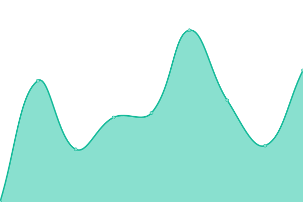

# [📈 Live Status](https://demo.upptime.js.org): <!--live status--> **🟧 Partial outage**

This repository contains the open-source uptime monitor and status page for [Upptime](https://upptime.js.org), powered by [Upptime](https://github.com/upptime/upptime).

With [Upptime](https://upptime.js.org), you can get your own unlimited and free uptime monitor and status page, powered entirely by a GitHub repository. We use [Issues](https://github.com/upptime/upptime/issues) as incident reports, [Actions](https://github.com/elfoche/monitoreo/actions) as uptime monitors, and [Pages](https://demo.upptime.js.org) for the status page.

<!--start: status pages-->
<!-- This summary is generated by Upptime (https://github.com/upptime/upptime) -->
<!-- Do not edit this manually, your changes will be overwritten -->
<!-- prettier-ignore -->
| URL | Status | History | Response Time | Uptime |
| --- | ------ | ------- | ------------- | ------ |
|  [UNER - Web](https://uner.edu.ar) | 🟩 Up | [uner-web.yml](https://github.com/elfoche/monitoreo/commits/HEAD/history/uner-web.yml) | 

 1147ms
     
 | 

<a href="https://elfoche.github.io/monitoreo/history/uner-web">100.00%</a>
    

|  [UNER - Campus](https://campus.uner.edu.ar) | 🟩 Up | [uner-campus.yml](https://github.com/elfoche/monitoreo/commits/HEAD/history/uner-campus.yml) | 

 1113ms
     
 | 

<a href="https://elfoche.github.io/monitoreo/history/uner-campus">100.00%</a>
    

|  [UNER - Campus FCA](https://campus.uner.edu.ar/fca/) | 🟩 Up | [uner-campus-fca.yml](https://github.com/elfoche/monitoreo/commits/HEAD/history/uner-campus-fca.yml) | 

 328ms
     
 | 

<a href="https://elfoche.github.io/monitoreo/history/uner-campus-fca">100.00%</a>
    

|  [UNER - Campus FCAL](https://campus.uner.edu.ar/fcal/) | 🟩 Up | [uner-campus-fcal.yml](https://github.com/elfoche/monitoreo/commits/HEAD/history/uner-campus-fcal.yml) | 

 341ms
     
 | 

<a href="https://elfoche.github.io/monitoreo/history/uner-campus-fcal">100.00%</a>
    

|  [UNER - Campus FCAD](https://campus.uner.edu.ar/fcad/) | 🟩 Up | [uner-campus-fcad.yml](https://github.com/elfoche/monitoreo/commits/HEAD/history/uner-campus-fcad.yml) | 

 358ms
     
 | 

<a href="https://elfoche.github.io/monitoreo/history/uner-campus-fcad">100.00%</a>
    

|  [UNER - Campus FBRO](https://campus.uner.edu.ar/fbro/) | 🟩 Up | [uner-campus-fbro.yml](https://github.com/elfoche/monitoreo/commits/HEAD/history/uner-campus-fbro.yml) | 

 322ms
     
 | 

<a href="https://elfoche.github.io/monitoreo/history/uner-campus-fbro">98.12%</a>
    

|  [UNER - Campus FCEDU](https://campus.uner.edu.ar/fcedu/) | 🟩 Up | [uner-campus-fcedu.yml](https://github.com/elfoche/monitoreo/commits/HEAD/history/uner-campus-fcedu.yml) | 

 358ms
     
 | 

<a href="https://elfoche.github.io/monitoreo/history/uner-campus-fcedu">100.00%</a>
    

|  [UNER - Campus FCS](https://campus.uner.edu.ar/fcs/) | 🟩 Up | [uner-campus-fcs.yml](https://github.com/elfoche/monitoreo/commits/HEAD/history/uner-campus-fcs.yml) | 

 352ms
     
 | 

<a href="https://elfoche.github.io/monitoreo/history/uner-campus-fcs">100.00%</a>
    

|  [UNER - Campus FCECO](https://campus.uner.edu.ar/fceco/) | 🟩 Up | [uner-campus-fceco.yml](https://github.com/elfoche/monitoreo/commits/HEAD/history/uner-campus-fceco.yml) | 

 366ms
     
 | 

<a href="https://elfoche.github.io/monitoreo/history/uner-campus-fceco">100.00%</a>
    

|  [UNER - Campus FIUNER](https://campus.uner.edu.ar/fiuner/) | 🟩 Up | [uner-campus-fiuner.yml](https://github.com/elfoche/monitoreo/commits/HEAD/history/uner-campus-fiuner.yml) | 

 316ms
     
 | 

<a href="https://elfoche.github.io/monitoreo/history/uner-campus-fiuner">100.00%</a>
    

|  [UNER - Campus FTS](https://campus.uner.edu.ar/fts/) | 🟩 Up | [uner-campus-fts.yml](https://github.com/elfoche/monitoreo/commits/HEAD/history/uner-campus-fts.yml) | 

 364ms
     
 | 

<a href="https://elfoche.github.io/monitoreo/history/uner-campus-fts">100.00%</a>
    

|  [UNER - Campus RECTORADO](https://campus.uner.edu.ar/rectorado/) | 🟩 Up | [uner-campus-rectorado.yml](https://github.com/elfoche/monitoreo/commits/HEAD/history/uner-campus-rectorado.yml) | 

 373ms
     
 | 

<a href="https://elfoche.github.io/monitoreo/history/uner-campus-rectorado">100.00%</a>
    

|  [UNER - Diaguita](https://diaguita.uner.edu.ar) | 🟩 Up | [uner-diaguita.yml](https://github.com/elfoche/monitoreo/commits/HEAD/history/uner-diaguita.yml) | 

 1107ms
     
 | 

<a href="https://elfoche.github.io/monitoreo/history/uner-diaguita">100.00%</a>
    

|  [UNER - Guaraní](https://g3autogestion.uner.edu.ar/g3w3/) | 🟩 Up | [uner-guarani.yml](https://github.com/elfoche/monitoreo/commits/HEAD/history/uner-guarani.yml) | 

 1098ms
     
 | 

<a href="https://elfoche.github.io/monitoreo/history/uner-guarani">100.00%</a>
    

|  [UNER - GitLab](https://gitlab.uner.edu.ar/users/sign_in) | 🟩 Up | [uner-git-lab.yml](https://github.com/elfoche/monitoreo/commits/HEAD/history/uner-git-lab.yml) | 

 907ms
     
 | 

<a href="https://elfoche.github.io/monitoreo/history/uner-git-lab">100.00%</a>
    

|  [UNER - DDJJ](https://autogestion.uner.edu.ar/) | 🟩 Up | [uner-ddjj.yml](https://github.com/elfoche/monitoreo/commits/HEAD/history/uner-ddjj.yml) | 

 899ms
     
 | 

<a href="https://elfoche.github.io/monitoreo/history/uner-ddjj">100.00%</a>
    

|  [UNER - Turnero](https://turnosfirmadigital.uner.edu.ar/nuevo-turno) | 🟩 Up | [uner-turnero.yml](https://github.com/elfoche/monitoreo/commits/HEAD/history/uner-turnero.yml) | 

 927ms
     
 | 

<a href="https://elfoche.github.io/monitoreo/history/uner-turnero">100.00%</a>
    

|  [UNER - Redmine](https://redmine.uner.edu.ar/) | 🟩 Up | [uner-redmine.yml](https://github.com/elfoche/monitoreo/commits/HEAD/history/uner-redmine.yml) | 

 967ms
     
 | 

<a href="https://elfoche.github.io/monitoreo/history/uner-redmine">100.00%</a>
    

|  [UADER - Web](https://fcytcdelu.uader.edu.ar/) | 🟩 Up | [uader-web.yml](https://github.com/elfoche/monitoreo/commits/HEAD/history/uader-web.yml) | 

 1771ms
     
 | 

<a href="https://elfoche.github.io/monitoreo/history/uader-web">99.77%</a>
    

|  [UADER - Campus](https://campus.fcytcdelu.uader.edu.ar/) | 🟩 Up | [uader-campus.yml](https://github.com/elfoche/monitoreo/commits/HEAD/history/uader-campus.yml) | 

 2026ms
     
 | 

<a href="https://elfoche.github.io/monitoreo/history/uader-campus">100.00%</a>
    

|  [UADER - Guaraní](http://guarani3w.uader.edu.ar/gestion/) | 🟩 Up | [uader-guarani.yml](https://github.com/elfoche/monitoreo/commits/HEAD/history/uader-guarani.yml) | 

 858ms
     
 | 

<a href="https://elfoche.github.io/monitoreo/history/uader-guarani">100.00%</a>
    

|  [UADER - Bases](https://pg.fcytcdelu.uader.edu.ar/) | 🟩 Up | [uader-bases.yml](https://github.com/elfoche/monitoreo/commits/HEAD/history/uader-bases.yml) | 

 1200ms
     
 | 

<a href="https://elfoche.github.io/monitoreo/history/uader-bases">100.00%</a>
    

|  [UCU - Web](https://ucu.edu.ar) | 🟩 Up | [ucu-web.yml](https://github.com/elfoche/monitoreo/commits/HEAD/history/ucu-web.yml) | 

 1831ms
     
 | 

<a href="https://elfoche.github.io/monitoreo/history/ucu-web">100.00%</a>
    

|  [UCU - Campus](https://moodle.ucu.edu.ar/) | 🟩 Up | [ucu-campus.yml](https://github.com/elfoche/monitoreo/commits/HEAD/history/ucu-campus.yml) | 

 909ms
     
 | 

<a href="https://elfoche.github.io/monitoreo/history/ucu-campus">100.00%</a>
    

|  [UCU - SAO](https://alumnos.ucu.edu.ar/) | 🟥 Down | [ucu-sao.yml](https://github.com/elfoche/monitoreo/commits/HEAD/history/ucu-sao.yml) | 

 721ms
     
 | 

<a href="https://elfoche.github.io/monitoreo/history/ucu-sao">100.00%</a>
    

|  [UCU - SIG](http://administracion.ucu.edu.ar/) | 🟩 Up | [ucu-sig.yml](https://github.com/elfoche/monitoreo/commits/HEAD/history/ucu-sig.yml) | 

 472ms
     
 | 

<a href="https://elfoche.github.io/monitoreo/history/ucu-sig">100.00%</a>
    

|  [UCU - Koha](http://biblioteca.ucu.edu.ar/) | 🟩 Up | [ucu-koha.yml](https://github.com/elfoche/monitoreo/commits/HEAD/history/ucu-koha.yml) | 

 2747ms
     
 | 

<a href="https://elfoche.github.io/monitoreo/history/ucu-koha">99.08%</a>
    

|  [UCU - Maraton](https://maraton.ucu.edu.ar/) | 🟥 Down | [ucu-maraton.yml](https://github.com/elfoche/monitoreo/commits/HEAD/history/ucu-maraton.yml) | 

 3613ms
     
 | 

<a href="https://elfoche.github.io/monitoreo/history/ucu-maraton">0.06%</a>
    

|  [UCU - Acceso IS](https://accesois.ucu.edu.ar/) | 🟩 Up | [ucu-acceso-is.yml](https://github.com/elfoche/monitoreo/commits/HEAD/history/ucu-acceso-is.yml) | 

 2464ms
     
 | 

<a href="https://elfoche.github.io/monitoreo/history/ucu-acceso-is">100.00%</a>
    

|  [UCU - Acceso FIBER](https://accesofiber.ucu.edu.ar/) | 🟥 Down | [ucu-acceso-fiber.yml](https://github.com/elfoche/monitoreo/commits/HEAD/history/ucu-acceso-fiber.yml) | 

 0ms
     
 | 

<a href="https://elfoche.github.io/monitoreo/history/ucu-acceso-fiber">0.00%</a>
    

|  [MCU - Web](https://cdeluruguay.gob.ar/) | 🟩 Up | [mcu-web.yml](https://github.com/elfoche/monitoreo/commits/HEAD/history/mcu-web.yml) | 

 2021ms
     
 | 

<a href="https://elfoche.github.io/monitoreo/history/mcu-web">90.25%</a>
    

|  [MCU - GTH](http://produccion.cdeluruguay.gob.ar/GTH/forms/login.jsp) | 🟩 Up | [mcu-gth.yml](https://github.com/elfoche/monitoreo/commits/HEAD/history/mcu-gth.yml) | 

 816ms
     
 | 

<a href="https://elfoche.github.io/monitoreo/history/mcu-gth">99.60%</a>
    

|  [MCU - GAF](http://produccion.cdeluruguay.gob.ar/GAF/forms/login.jsp) | 🟩 Up | [mcu-gaf.yml](https://github.com/elfoche/monitoreo/commits/HEAD/history/mcu-gaf.yml) | 

 170ms
     
 | 

<a href="https://elfoche.github.io/monitoreo/history/mcu-gaf">99.60%</a>
    

|  [MCU - GRH](http://produccion.cdeluruguay.gob.ar/GRH/forms/login.jsp) | 🟩 Up | [mcu-grh.yml](https://github.com/elfoche/monitoreo/commits/HEAD/history/mcu-grh.yml) | 

 221ms
     
 | 

<a href="https://elfoche.github.io/monitoreo/history/mcu-grh">99.60%</a>
    

|  [MCU - GAT](http://produccion.cdeluruguay.gob.ar/GAT/forms/login.jsp) | 🟩 Up | [mcu-gat.yml](https://github.com/elfoche/monitoreo/commits/HEAD/history/mcu-gat.yml) | 

 207ms
     
 | 

<a href="https://elfoche.github.io/monitoreo/history/mcu-gat">99.60%</a>
    

|  [MCU - GTH](http://produccion.cdeluruguay.gob.ar/GTH/forms/login.jsp) | 🟩 Up | [mcu-gth.yml](https://github.com/elfoche/monitoreo/commits/HEAD/history/mcu-gth.yml) | 

 816ms
     
 | 

<a href="https://elfoche.github.io/monitoreo/history/mcu-gth">99.60%</a>
    

|  [MCU - STS](http://produccion.cdeluruguay.gob.ar/STS/forms/login.jsp) | 🟩 Up | [mcu-sts.yml](https://github.com/elfoche/monitoreo/commits/HEAD/history/mcu-sts.yml) | 

 211ms
     
 | 

<a href="https://elfoche.github.io/monitoreo/history/mcu-sts">99.60%</a>
    

|  [MCU - Owncloud](https://cloud.cdeluruguay.gob.ar/login?redirect_url=/apps/dashboard/) | 🟩 Up | [mcu-owncloud.yml](https://github.com/elfoche/monitoreo/commits/HEAD/history/mcu-owncloud.yml) | 

 2190ms
     
 | 

<a href="https://elfoche.github.io/monitoreo/history/mcu-owncloud">99.55%</a>
    

|  [MCU - Proyectos](http://proyectos.cdeluruguay.gob.ar/login?back_url=http%3A%2F%2Fproyectos.cdeluruguay.gob.ar%2F) | 🟩 Up | [mcu-proyectos.yml](https://github.com/elfoche/monitoreo/commits/HEAD/history/mcu-proyectos.yml) | 

 2698ms
     
 | 

<a href="https://elfoche.github.io/monitoreo/history/mcu-proyectos">100.00%</a>
    

|  [MCU - GitLab](https://git.cdeluruguay.gob.ar/users/sign_in) | 🟩 Up | [mcu-git-lab.yml](https://github.com/elfoche/monitoreo/commits/HEAD/history/mcu-git-lab.yml) | 

 1690ms
     
 | 

<a href="https://elfoche.github.io/monitoreo/history/mcu-git-lab">100.00%</a>
    

|  [Google AR](https://www.google.com.ar) | 🟩 Up | [google-ar.yml](https://github.com/elfoche/monitoreo/commits/HEAD/history/google-ar.yml) | 

 165ms
     
 | 

<a href="https://elfoche.github.io/monitoreo/history/google-ar">100.00%</a>
    

<!--end: status pages-->

[**Visit our status website →**](https://demo.upptime.js.org)

## 📄 License

- Powered by: [Upptime](https://github.com/upptime/upptime)
- Code: [MIT](./LICENSE) © [Upptime](https://upptime.js.org)
- Data in the `./history` directory: [Open Database License](https://opendatacommons.org/licenses/odbl/1-0/)

## Agregue Telegram
